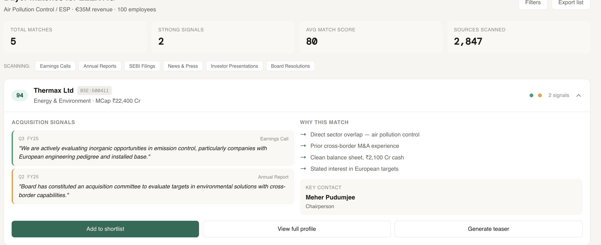

# Prospecting

**Claude Link: [https://claude.ai/share/2a113c41-7a0c-4788-ae71-eab215557b8d](https://claude.ai/share/2a113c41-7a0c-4788-ae71-eab215557b8d)**

**Artifact: [https://claude.ai/public/artifacts/1facb26c-1a68-4b2c-a5f3-7526bcd9d72f](https://claude.ai/public/artifacts/1facb26c-1a68-4b2c-a5f3-7526bcd9d72f)**

https://claude.ai/public/artifacts/4883db51-286e-4e65-a3d8-906be11531d0

Chat link: https://claude.ai/share/2a113c41-7a0c-4788-ae71-eab215557b8d

Anmol Input: where to invoke Exa API?

Prompt and flow structure?

### **Problem Statement:**

[https://www.elex.ch/en/](https://www.elex.ch/en/)
For ex, this is a company on sale, being run by our Swiss Partners. We would like to find out, who would be ideal buyers for this in India. Assess basis say the quarterly calls of listed companies, if they are looking to acquire anything etc.

When an investment bank takes a sell-side mandate — say, a Swiss air pollution control company — the team needs to find who in India would want to buy it. Today this takes weeks of manual work: reading earnings call transcripts, scanning annual reports, checking SEBI filings, all to spot sentences like "we are exploring inorganic growth in environmental services."
We are building a product that does this using LLMs as the core intelligence engine. The platform is essentially a prompt-orchestration layer: the user sets variables (target company, buyer persona, revenue range, geography), and the system constructs and chains Claude prompts to scrape, profile, match, and rank potential acquirers — citing every signal back to its source.
The product is NOT a heavy backend ML pipeline. It is a well-designed prompt system with structured inputs, Claude doing the reasoning, and a clean UI presenting the output.

### Scoping:

- Chat interface can be version 2 (coming soon)
- Fetch transcripts from FMP - otherwise use Claude itself for getting the latest transcripts.

## Success Criteria for the Demo

- User enters elex.ch → gets a ranked list of 15–20 Indian companies in < 10 minutes.
- Top 5 ranked companies make intuitive sense to someone who knows the sector.
- At least 3–5 companies show real acquisition signals with exact transcript quotes.
- Every signal is cited with source and quarter.
- Expandable rows show clear reasoning for why each company is ranked where it is.

### User-Configurable Variables

These are the inputs the user sets before running the pipeline. Each variable directly shapes the prompts sent to Claude.

| Variable | UI Element | How It Shapes the Prompt |
| --- | --- | --- |
| **Target company URL** | Text input | Scraped content is injected into the profiling prompt as context |
| **Target sector** | Auto-filled after profiling, editable | Determines which companies to search for and which transcripts to analyse |
| **Buyer persona** | Multi-select checkboxes: Strategic, Private Equity, Conglomerate | Filters prospect list; changes the scoring prompt (e.g., "prioritise strategic buyers, deprioritise conglomerates unless direct signal match") |
| **Revenue range** | Min–Max slider (in ₹ Cr or USD M) | Injected as a constraint: "Only include companies with revenue greater than [target revenue] and less than [5× target revenue] for strategic buyers" |
| **Geography** | Dropdown, default: India | Constrains prospect search. V1 is India-only |
| **Signal keywords** | Optional text input, user can add custom signals | Appended to signal extraction prompt: "In addition to standard acquisition signals, also look for mentions of: [user keywords]" |
| **Matching weights** | Sliders for each dimension (sector fit, tech gap, geography, financial capacity, timing, product mix) | Weights are injected into the scoring prompt: "Weight sector adjacency at [X]%, technology gap at [Y]%..." |
| **Number of results** | Dropdown: 10 / 25 / 50 | Controls how many companies to process through the full pipeline |

### User Flow

User pastes target company URL (e.g., [elex.ch](http://elex.ch/))
↓
System scrapes the website, Claude profiles it (sector, size, tech, geography)
↓
User confirms/edits the profile, selects buyer persona filter
↓
Two parallel tracks:
Track A: Claude - to do a web search on public companies - with similar profile
Track B: Claude-powered web search to discover private Indian companies
with similar/complementary product mix
↓
System fetches signals from multiple sources:

- Earnings transcripts (FMP API) — for listed companies
- Annual reports (investor relations pages) — M&A strategy, capex guidance
- SEBI disclosures — acquisition intent filings
- Board resolutions — M&A committee formation, acquisition approvals
↓
Claude extracts acquisition signals from all sources
↓
Claude scores each buyer (listed + private) against the target
↓
User sees a ranked table with scores, signals, and citations

### UX- Sample?

Left tab: Prospecting- focus on only Sell side mandate , grey out buy side (Coming soon)

After analysing the input company, the list of companies that can buy the target company should be like this:

**Our USP is finding the list of companies (Buyers company) that can buy the target company.** 

- Signals come from earnings transcripts
- Finding the right match in terms of revenue / size / product mix/ strategic
- add a chat interface for in depth discussion on the right

## Prompt Chain — Step by Step

The entire product is a sequence of Claude calls. Here is each step, what the prompt does, what variables feed into it, and what the expected output looks like.

### Step 1: Target Company Profiling

**Trigger:** User enters a target company URL and hits "Analyse."

**What happens:**

1. The system scrapes the target company's website (use a web scraping tool or Claude's web fetch where available).
2. The scraped text is sent to Claude with a profiling prompt.

**Prompt structure (simplified):**

`You are an M&A analyst. Given the following website content from a company,
produce a structured profile.

Website content:
{scraped_website_text}

Extract:
- Company name
- What they do (2-3 sentences)
- Sector classification (3 levels: e.g., Industrials → Environmental Services → Air Pollution Control)
- Key technologies or IP
- Estimated size (employees, revenue range if inferable)
- Geographic footprint
- Years in operation
- Any India presence or connection
- Strategic notes (what makes this company valuable to an acquirer)

Respond in JSON format.`

**Output:** A structured target profile JSON that gets stored and passed into subsequent prompts.

**User interaction:** The auto-filled sector and profile are shown to the user. They can edit any field before proceeding. This is important — the user should be able to correct the AI's classification before it drives the rest of the pipeline.

---

**Step 2: Prospect List Generation**

**Trigger:** User confirms the target profile and sets filters (persona, revenue range).

- List of persona: Strategic, PE, Conglomerate
- Geography: India
- Sector : Target company sector. (strategic), Private equity fund : Find the fund operating in that sector.
- Product mix may be similar
- Any other notes for buyer (Input from user)

**What happens:**

1. The system uses the target's sector classification to search for companies. This is the one step that needs external data — use the FMP API, Screener.in scraping, or a pre-built Indian company database.
2. The raw company list is sent to Claude for filtering and classification.

**Prompt structure:**

`You are an M&A analyst building a buyer prospect list.

Target company profile:
{target_profile_json}

User filters:
- Buyer personas to include: {selected_personas}  // e.g., ["Strategic", "Conglomerate"]
- Revenue range: {min_revenue} to {max_revenue}
- Geography: {geography}

For each company, classify:
1. Persona type (Strategic / PE / Conglomerate)
2. Sector relevance to the target (exact match, adjacent, or tangential)
3. Whether their product mix complements or overlaps with the target
4. Estimated revenue (if known)

Filter out companies below the target's revenue.
Sort: Strategic buyers first, then PE, then Conglomerates — unless a conglomerate
has a direct sector match, in which case promote it.

Respond in JSON array format.`

**For private companies:** Use a separate Claude call with web search enabled to find private Indian companies in the relevant sector. The prompt asks Claude to search, identify companies, and extract basic profiles from their websites.

**Output:** A filtered, classified prospect list (JSON array) with 25–50 companies.

---

### Step 3: Signal Extraction from Earnings Transcripts

**Trigger:** Prospect list is ready. System fetches earnings transcripts for each listed company.

**Data source:** FMP API → earnings call transcripts endpoint. Pull last 4–8 quart**ers per company.**

**Also fetch the investor presentations, SEBI disclosures, board resolutions etc.** 

**What happens:** For each company's transcript, send it to Claude with a signal extraction prompt.

**Prompt structure:**

`You are an M&A intelligence analyst. Read the following earnings call transcript
and extract any signals that indicate this company might be interested in
acquiring a business.

Company: {company_name}
Transcript: {transcript_text}
Quarter: {quarter}

Target company profile (for context — you are looking for signals that this
buyer might want to acquire a company like this):
{target_profile_json}

Look for:
1. Mentions of inorganic growth, acquisitions, M&A strategy
2. Interest in expanding into the target's sector or adjacent sectors
3. Mentions of the target's geography (Europe, specifically)
4. Technology gaps that the target could fill
5. Capex guidance that suggests acquisition budget
6. Board-level M&A committee formation
7. Any specific product categories the target operates in

{user_custom_signals}  // e.g., "Also look for mentions of ESP technology,
                       // flue gas treatment, or pollution control equipment"

For each signal found, extract:
- The exact quote from the transcript (for citation)
- Signal type (acquisition_intent / sector_expansion / technology_gap /
  geographic_interest / capex_signal / board_action)
- Strength (high / medium / low) — high means explicit acquisition intent,
  low means indirect indicator
- Your reasoning for why this is relevant to the target

If no relevant signals are found, say so explicitly. Do not fabricate signals.

Respond in JSON format.`

**Important implementation note:** This is the most token-intensive step. Each transcript can be 10,000–30,000 tokens. For 50 companies × 4 quarters = 200 transcripts. Use Claude's batch API to process these cost-effectively. Cache results — transcripts don't change once published.

**Output:** A signals database — structured JSON linking each signal to a company, source, date, and exact quote.

**Private companies** - signals- similar revenue, similar product mix, same sub sector match. 

---

### Step 4: Multi-Dimensional Matching & Scoring

**Trigger:** Signals are extracted. Now score each prospect against the target.

**Prompt structure:**

`You are an M&A matching engine. Score the following potential buyer against
the target company across multiple dimensions.

Target company:
{target_profile_json}

Potential buyer:
{buyer_profile_json}

Signals found for this buyer:
{buyer_signals_json}

Score on these dimensions (each out of 10):

1. Sector Adjacency (weight: {sector_weight}%)
   Does the buyer operate in the target's sector or a related one?

2. Technology Gap (weight: {tech_weight}%)
   Does the buyer lack capabilities that the target provides?

3. Geographic Strategy (weight: {geo_weight}%)
   Has the buyer shown interest in the target's geography?

4. Financial Capacity (weight: {financial_weight}%)
   Revenue ratio, balance sheet strength, past cross-border deal experience?

5. Timing Signals (weight: {timing_weight}%)
   How recent and explicit are the acquisition signals? Last 2 quarters = high.

6. Product Mix Complementarity (weight: {product_weight}%)
   Do the buyer's products complement (not duplicate) the target's?

For each dimension, provide:
- Score (0-10)
- One-line justification
- Supporting signal quote (if applicable, with source citation)

Calculate overall weighted score.

Respond in JSON format.`

**Output:** Scored prospect list, ready for ranking and display.

---

### Step 5: Chat Interface (Drill-Down & Customisation)

**What it is:** A conversational interface on the right panel where the user can interrogate the results.

**How it works:** Each chat message is a Claude call with the full context (target profile + prospect list + all signals) injected as system context.

**System prompt for chat:**

`You are an M&A intelligence assistant. You have analysed the following target
company and built a prospect list of potential acquirers.

Target: {target_profile_json}
Prospect list with scores: {scored_prospects_json}
All extracted signals: {all_signals_json}

The user is an investment banker reviewing this list. Help them:
- Explain why any company is ranked where it is
- Show exact transcript quotes when asked
- Accept new signals the user provides and re-evaluate rankings
- Answer strategic questions about fit
- Always cite your sources (transcript name, quarter, page)

Never fabricate information. If you don't have data on something, say so.`

**Key user actions in chat:**

- "Why is Thermax ranked #1?" → Claude explains dimension scores with citations.
- "Add a signal: XYZ Corp's CEO mentioned interest in ESP at a conference" → System adds to signals, optionally re-runs scoring.
- "Remove conglomerates from the list" → Updates the persona filter variable, regenerates.
- "What if I weight technology gap higher?" → User adjusts weights, system re-runs Step 4.

## UI Layout

**Left sidebar (narrow):**

- Tab: "Prospecting" (active) — Sell-side only for V1. Buy-side tab greyed out with "Coming Soon."

**Centre panel:**

- **Top section:** Input form — target company URL, auto-filled sector, persona checkboxes, revenue range slider.
- **Main section:** Results table after analysis completes.

**Results table columns:**

| Rank | Company | Persona | Sector | Revenue | Fit Score | Top Signal | Source |
| --- | --- | --- | --- | --- | --- | --- | --- |
| 1 | Thermax Ltd | Strategic | Environmental Equipment | ₹8,200 Cr | 87 | "Exploring inorganic opportunities in pollution control" | Q3 FY26 Earnings Call |
- Each row is expandable → shows all signals, all dimension scores, LLM reasoning.
- Every signal has a clickable citation link.

**Right panel:**

- Chat interface for drill-down, questions, and manual signal entry.

## Key Principles:

1. **Claude is the engine, not the database.** Every analytical step is a Claude prompt. The backend's job is to orchestrate prompts, manage variables, cache results, and serve the UI. Keep the backend thin.
2. **Every output must be cited.** If a signal is shown, the user must be able to click through to the source transcript and see the exact quote. No black box. Store the source URL, document name, quarter, and verbatim quote with every signal.
3. **User variables drive the prompts.** The persona filter, revenue range, custom signals, and matching weights should all be injected into prompts as variables. When the user changes a variable, the relevant prompt re-runs. Make this reactive.
4. **Prompt design is product design.** The quality of output depends entirely on prompt quality. Build an eval set — 20 transcripts manually labelled with expected signals — and test prompts against it before shipping. Iterate on prompts like you would iterate on UI.

### Iterations

- Scan the private companies as well-
    - Find private companies in that sector
    - Check the companies’ website, get USP, sector etc.
    - Find revenue range
- Signals to incorporate in the buyers list :
    - Persona - focus the list- give more strategic than conglomerates, unless a direct conglomerate signal or a match. - Drop down checklist- Strategic, conglomerate, Private Equity
    
    How to shortlist based on the buyers list:
    
    - Revenue should be greater than the “target” Company
    - See if product mix complements the target company- highlight that in signals.
    - Check earnings transcripts of public listed companies
    - Check similar private listed companies- that are strategic in nature, with similar product mix
    - Avoid conglomerates (put them below in the list)
- Mapping target company attributes (sector, size, technology, geography, IP) against buyer signals. The matching needs to be multi-dimensional:
    - sector adjacency (does the buyer operate in air pollution control, or in adjacent areas like water treatment and could plausibly expand?),
    - technology gap analysis (does the buyer lack ESP capability that the target provides?), geographic strategy (has the buyer signaled interest in European markets or technology access?),
    - financial capacity (does the buyer have the balance sheet and past precedent of doing cross-border deals of this size?),
    - timing signals (are they actively looking now, based on recent statements?).

**Check earnings transcripts:**

- Inorganic growth, acquisitions (Signals)

**Check for intent:**

- **check annual reports for capex guidance and M&A strategy sections,**
- **board resolutions mentioning acquisition committees, and**
- **Any SEBI disclosures of acquisition intent.**

### Product Direction (Self notes)

1. Data Scraping
2. Actionables by AI
3. Show / charts etc. - UI 

Prototyping: [https://claude.ai/public/artifacts/88243958-fcfe-4301-a514-bbc9c92fcd78](https://claude.ai/public/artifacts/88243958-fcfe-4301-a514-bbc9c92fcd78)

Interfacing:

- Keep SaaS like interface, not purely chat, but chat interface to work with the product / give optimisations?
- Show signals that worked well- cite the earnings report
- Everything should be cited.
- Earnings call transcripts- Use APIs for better accuracy.
- FMP API Key: UQur331zbD5t6N5Nu0Wyrop8J7wXzNuy (To buy expensive one, and check india ticker coverage) - Any other option?
    - MCP / connectors on Claude?
- Give the user an option to enter signals as well, after the AI recommends- customise, no black box in terms of reasoning.

1. **Intelligence Engine**
- Need to ingest and structure earnings call transcripts (BSE/NSE quarterly filings, concall transcripts from services like Tikr, ResearchBytes, and other providers),
- annual reports and investor presentations, SEBI disclosures (board resolutions, related-party transactions, acquisition announcements), and news/press releases.
- The NLP pipeline should extract "acquisition intent signals" — not just keyword matching, but contextual understanding.
1. **Matching with prospects**
This maps target company attributes (sector, size, technology, geography, IP) against buyer signals. The matching needs to be multi-dimensional: sector adjacency (does the buyer operate in air pollution control, or in adjacent areas like water treatment and could plausibly expand?), technology gap analysis (does the buyer lack ESP capability that the target provides?), geographic strategy (has the buyer signaled interest in European markets or technology access?), financial capacity (does the buyer have the balance sheet and past precedent of doing cross-border deals of this size?), and timing signals (are they actively looking now, based on recent statements?).

2. **(Coming Soon)- Deal Comparables matching**
    - comparable transactions,
    - valuation benchmarks,
    - regulatory considerations
- **(Coming Soon)- Deal Tracker**
a Kanban-style deal tracker. Once an IB team starts working a deal, they move buyers through stages (Identified → Approached → In Discussion → LOI).

### **How a Human works? (Taking this example only)**

1. **What the company in contention do?**

Step 1: Scraping + Crawling the website for useful information

- AI / non AI
- Semi structured information
- Non HTML etc.

Downloadable links - Remove Links 

Put this in the information in database

- Sector classification : In depth
    - Industrials / Energy / Environment..
    - Three levels of sector / subsector analysis that one would do.
- Size :
    - # employees,
    - likely revenue range
- Strategic notes - custom to the company
    - Some IP?
    - Number of years of record
    - Number of countries, India?
    
1. **Build the prospect list? Three personas usually - can add more.** 

Step 1: Find companies based on information of the being sold. 

- Exa tool usage

Constraint- Based out of India, Let us know if you want to expand geography?

- strategic (In this case: industrials (Thermax, Isgec, Enviropol, Ion Exchange, Intensiv Filter Himenviro),
- financial buyers (PE funds focused on that particular sector - in this case industrials/infrastructure), and
- conglomerates looking to enter the space (In this case: environmental services (Godrej, Tata group companies, L&T).

1. **Earnings Call & Filing Mining - IMP- MOST RELEVANT**

Data Source: (To be increased after some time)

- Earnings reports, transcripts
- Investor presentation
- Board resolutions (Investor tab)
- SEBI Disclosures

+++

**Check earnings transcripts:**

- Inorganic growth, acquisitions (Signals)

**Check for intent:**

- **check annual reports for capex guidance and M&A strategy sections,**
- **board resolutions mentioning acquisition committees, and**
- **Any SEBI disclosures of acquisition intent.**

// SIGNALS - Sanya to add

1. **LLM CALL**